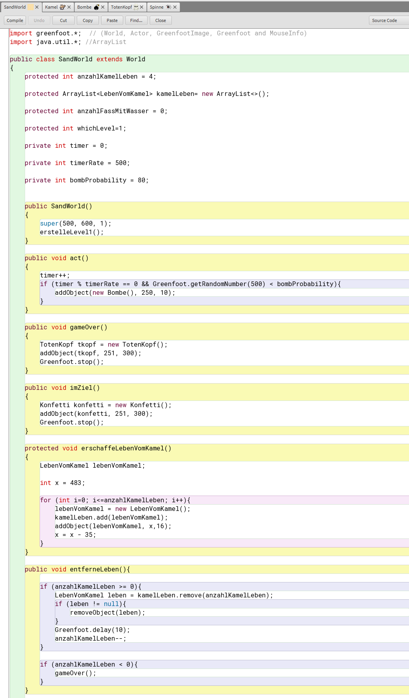
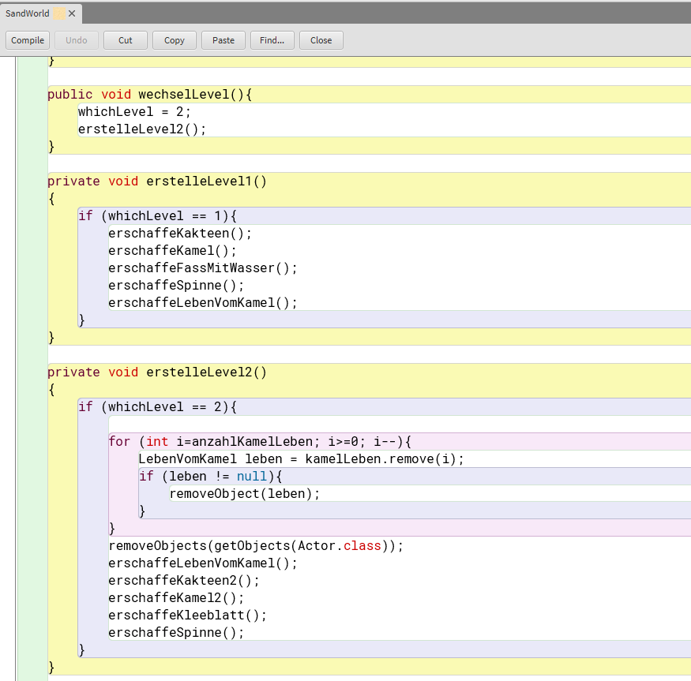
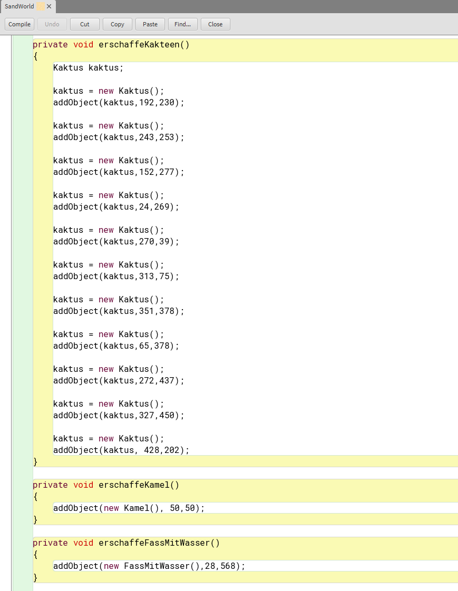
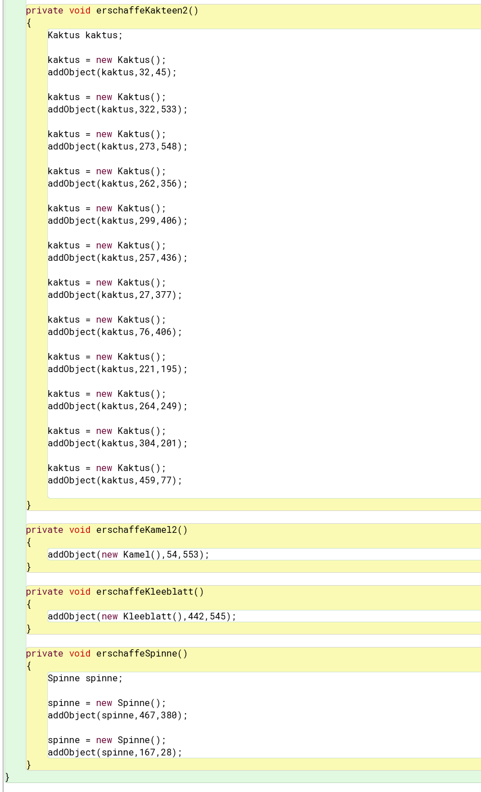
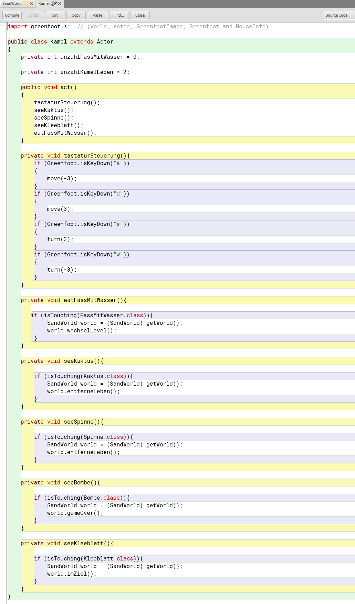
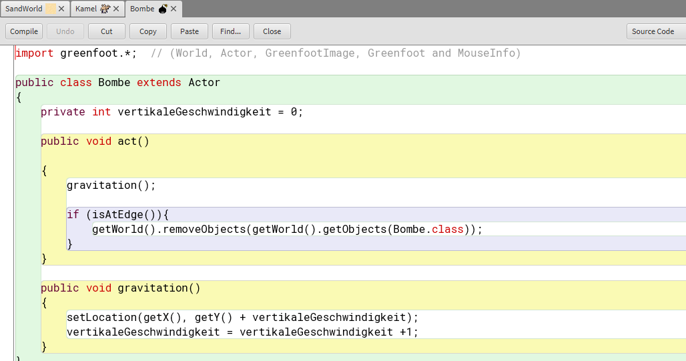
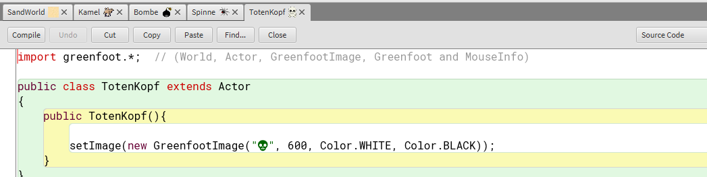
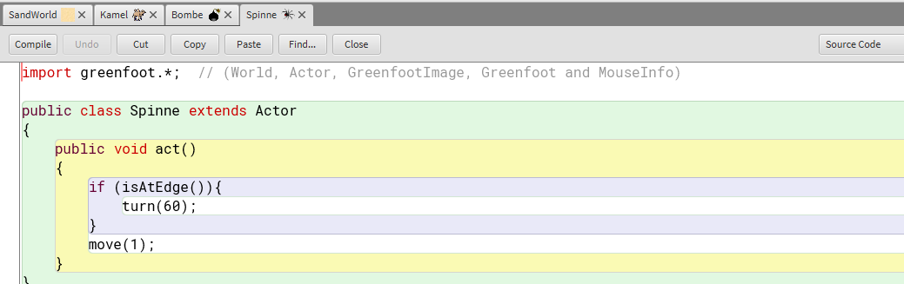

# Projektseite

### Inhaltsverzeichnis
<li><a href="#kapitel1.1">Programme</a></h2></li>
<li><a href="#kapitel1.2">Idee</a></h2></li>
<li><a href="#kapitel1.3">Anleitung</a></h2></li>
<li><a href="#kapitel1.4">Ergebnis</a></h2></li>
<li><a href="#kapitel1.5">Fazit</a></h2></li>
  
<h2 id="kapitel1.1">Programme</h2>

Für unser Projekt in diesem Halbjahr haben wir uns mit "Greenfoot" beschäftigt. "Greenfoot" ist ein Programm, bei welchem man mit "Java", einer objektorientierten Programmiersprache, arbeitet. Das Programm und die Programmiersprache wurden primär für Ausbildungszwecke entwickelt und zeichnen sich durch eine einfache Entwicklung zweidimensionaler graphischer Simulationen und Spiele aus. 

<h2 id="kapitel1.2">Idee</h2>
Die Idee unseres Spiels war ursprünglich etwas Wüstenähnliches beziehungsweise etwas zu programmieren, wo die Wüste eine Rolle spielt und was kein "Jump and Run" Spiel wie im ersten Halbjahr ist. Da wir uns auch erst einmal in ein neues Programm einarbeiten mussten haben wir uns dazu entschieden, ein Kaktus Labyrinth zu gestalten, welches von unserer Figur durchdrungen werden muss. Unser erster Gedanke war ein unendliches Labyrinth zu programmieren, damit wir zusätzlich noch einen anderen Spielaufbau als in unserem ersten Spiel haben. Wir mussten jedoch schnell feststellen, dass es einfacher ist, mehrere Level zu programmieren als ein unendlich laufendes Spiel, was eventuell auch dem Zeitfaktor geschuldet ist, da wir im ersten Halbjahr deutlich mehr Zeit zum Einarbeiten hatten als dieses Halbjahr.

<h2 id="kapitel1.3">Anleitung</h2>
Ziel unseres Spieles ist es, dass sich das Kamel durch das Kaktus-Universum bewegt und am Ende den Glücksklee zu finden und zu berühren. Die Spielsteuerung erfolgt über die Tastatur mit den Tasten "A" (= nach links), "D" (= nach rechts), "S" (= Drehung nach rechts) und "W" (= Drehung nach links). Der Spieler muss das Kamel so durch das Kaktus-Universum lenken, dass es weder die Kakteen noch die Spinnen berührt. Erschwert wird das Ganze durch zufällig erscheinende Bomben, die das Kamel sofort töten, weshalb das Spiel von vorne begonnen werden muss. Im ersten Level  gilt es das Holzfass (FassMitWasser) zu erreichen, um dem Kamel neue Ernergie für das zweite Level zu geben. Im zweiten Level muss das Kamel ebenfalls den Kakteen und Spinnen ausweichen und erreicht das Ziel, wenn der Glücksklee gefressen wurde. 

<h2 id="kapitel1.4">Ergebnis</h2>
In unserem Spiel muss sich ein Kamel durch ein Labyrinth aus Kakteen bewegen, wobei das Kamel pro Level 5 Leben hat, die in Form von roten Punkten am rechten, oberen Bildschirmrand angezeigt werden. Sowohl bei Berührung der Kakteen, als auch der Spinnen verliert das Kamel ein Leben. Trifft eine der zufällig erscheinenden Bomben das Kamel, ist das Kamel tot und das Spiel vorbei. Im Anschluss erscheint unser GameOver Bildschirm und das Spiel muss von vorne begonnen werden. 

**Level 1:**

**Level 2:**

Erklärung Ergebnis

Erklärung Code SandWorld

Zuerst wurde die Größe der SandWorld mit 500*600 Pixeln festgelegt.
  
Die "void"-Methode "act" sorgt dafür, dass die Bombe zufällig  bei x=250 und y=10 erscheint, wenn die zufällige Zahl von 0-500 (integer "timerRate") zwischen 0 und 80 (integer "bombProbability") liegt.

Die "void"-Methode "gameOver" lässt den GameOver-Bildschirm erscheinen und hält das Programm im selben Zuge an. Hierbei findet eine Kommunikation zwischen SandWorld und Kamel statt.

Die "void"-Methode "imZiel" lässt den Ziel-Bildschirm erscheinen und hält ebenfalls das Programm an. Auch hier funktioniert die Methode durch Kommunikation zwischen SandWorld und Kamel.

Für die "void"-Methode "erschaffeLebenVomKamel" musste eine ArrayList erstellt werden, die 5 Leben (integer "anzahlKamelLeben") in dem Spielfeld erscheinen lässt, die im Abstand von 35 Pixeln zueinander positioniert sind.
  
Die "void"-Methode "entferneLeben" greift auf die, in der Methode "erschaffeLebenVomKamel" erstellte ArrayList, zurück und entfernt solange ein LebenVomKamel bis keine mehr vorhanden sind, tritt dieser Fall ein, erscheint der GameOver-Bildschirm.
  
Die "void"-Methode "wechselLevel" ist ebenfalls auf die Kommunikation mit dem Kamel angewiesen, da diese ausgelöst wird, wenn das Kamel die "void"-Methode "eatFassMitWasser" aufruft, denn nur dann wird von der SandWorld angewiesen, dass das zweite Level erstellt werden soll.
  
Die "void"-Methode "erstelleLevel1" fasst die einzelnen Positionierungen der Objekte, die für das erste Level relevant sind, zusammen, damit der Code insgesamt übersichtlicher ist.
  
Ebenso ist die "void"-Methode "erstelleLevel2" für die Positionierung der Objekte aus dem zweiten Level wichtig, wobei bei dieser Methode wichtig ist, dass zuerst alle LebenVomKamel aus der ArrayList gelöscht werden und dann erst alle Objekte des ersten Levels aus der SandWorld entfernt werden, woraufhin dann das zweite Level erstellt werden kann.
  

Mit folgenden "void"-Methoden werden die Positionen der einzelnen Objekte der beiden Level festgelegt. Bei den Methoden wo eine 2 hinter dem Methodennamen steht sind Objekte des zweiten Levels gemeint (zum Beispiel "erschaffeKakteen2"). Die LebenVomKamel ändern ihre Position in den beiden Leveln nicht, genauso wie die Spinnen, weshalb diese Objekte ohne eine 2 hinter ihrer Bezeichnung stehen bleiben. Dadurch, dass das Kleeblatt erst im zweiten Level auftauch bekommt auch dieses keine 2 zugewiesen. 
  

  

Erklärung Code Kamel

Für die Tastatursteuerung des Kamels wurden die verschiedenen Richtungen auf die "A", "D", "S" und "W" Tasten aufgeteilt, dabei sorgt die "A" Taste dafür, dass sich das Kamel nach links bewegt, die "D" Taste für eine Bewegung nach rechts, mit der "S" Taste dreht sich das Kamel nach rechts und "W" Taste erfolgt eine Drehung nach links. 

Mit der "void"-Methode "eatFassMitWasser" ist gemeint, dass wenn das Kamel das Fass berührt, eine Verbindung zur SandWorld aufgebaut wird und diese dann den Levelwechsel auslöst.
  
Die zwei "void"-Methoden "seeKaktus" und "seeSpinne" haben die geleiche Funktionsweise, nur, dass bei der einen Methode der Kaktus und bei der anderen die Spinne Auslöser des Verbindungsaufbaus zur SandWorld ist, damit diese dann ein LebenVomKamel entfernen kann. 
  
Die "void"-Methode "seeBombe" funktioniert ähnlich, wie die Methoden davor, nur beendet die SandWorld das Spiel und der GameOver-Bildschirm erscheint.
  
Auch die "void"-Methode "seeKleeblatt" hat die gleiche Funktionsweise mit dem einzigen Unterschied, dass die SandWorld den Ziel-Bildschirm erscheinen lässt.
  
Am Ende sind alle "private void"-Methoden in der "public void"-Methode zusammengefasst aufgeschrieben, damit die Verbindung und Kommunikation mit der SandWorld stattfinden kann.
  

  

Erklärung Code Bombe

Für die Gravitation muss eine Variable mit einem "integer" erstellt werden, damit man in der "void"-Methode die Fallgeschwindigkeit immer um 1 erhöhen kann, wodurch das Fallen der Bombe realistischer aussieht. Damit sich die Bomben am Ende nicht alle am unteren Bildschirmrand sammeln, musste noch programmiert werden, dass die Bomben verschwinden, sobald sie den Rand des "Spielfeldes" berühren.

  

Erklärung Code TotenKopf

Im TotenKopf wurde programmiert, dass ein Totenkopfbild in der Größe 600*600 Pixeln in schwarz-weiß entsteht.
  

  

Erklärung Code Spinne

Für die Spinne wurde programmiert, dass sie sich um 60° dreht, sobald sie den Rand des "Spielfeldes" berührt und sich ansonsten immer um 1 Längeneinheit bewegt.
  

<h2 id="kapitel1.5">Fazit</h2>
In diesem Halbjahr sollte es eine Steigerung zum Projekt des ersten Halbjahres geben, weshalb wir nich noch einmal mit "Snap" arbeiten durften, sondern uns in ein neues Programm einarbeiten mussten. Hierfür haben wir uns "Greenfoot" ausgesucht, da schon im ersten Halbjahr einige mit diesem Programm gearbeitet haben und von einer relativ einfachen Handhabung erzählt haben. Leider konnten wir die einfache Handhabung auch nach längerem Arbeiten nicht feststellen und unser Arbeiten beschäftigte sich größtenteils mit Fehler beheben, Ansätze zum Programmieren googlen und Herrn Buhl oder Mitschüler um Hilfe bitten, wenn wir alleine keinen Lösungsansatz finden konnten. Aus diesem Grund haben wir es leider nicht schaffen können, unserer Anfangsvorstellung vom Projekt gerecht zu werden und unsere eigenen Ansprüche zu erfüllen. Dennoch haben wir nach der intensiven Arbeit mit diesem Programm den Umgang mit "Java" gelernt und ebenso, den Aufbau dieser Programmiersprache, was uns trotz der vielen Probleme und Rückschritte positiv in Erinnerung bleiben wird.
