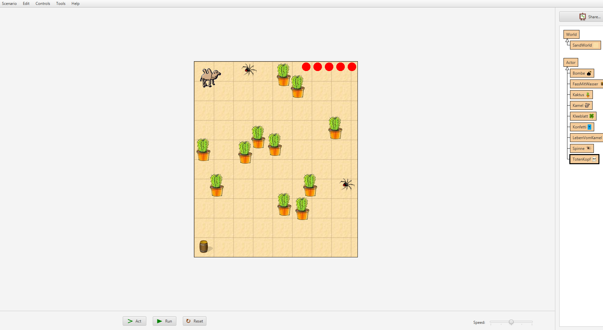

# Projektseite

### Inhaltsverzeichnis
<li><a href="#kapitel1.1">Programme</a></h2></li>
<li><a href="#kapitel1.2">Idee</a></h2></li>
<li><a href="#kapitel1.3">Ergebnis</a></h2></li>
<li><a href="#kapitel1.4">Fazit</a></h2></li>
  
<h2 id="kapitel1.1">Programme</h2>

<h2 id="kapitel1.2">Idee</h2>

<h2 id="kapitel1.3">Ergebnis</h2>

Erklärung Ergebnis

<h2 id="kapitel1.4">Fazit</h2>
In diesem Halbjahr sollte es eine Steigerung zum Projekt des ersten Halbjahres geben, weshalb wir nich noch einmal mit "Snap" arbeiten durften, sondern uns in ein neues Programm einarbeiten mussten. Hierfür haben wir uns "Greenfoot" ausgesucht, da schon im ersten Halbjahr einige mit diesem Programm gearbeitet haben und von einer relativ einfachen Handhabung erzählt haben. Leider konnten wir die einfache Handhabung auch nach längerem Arbeiten nicht feststellen und unser Arbeiten beschäftigte sich größtenteils mit Fehler beheben, Ansätze zum Programmieren googlen und Herrn Buhl oder Mitschüler um Hilfe bitten, wenn wir alleine keinen Lösungsansatz finden konnten. Aus diesem Grund haben wir es leider nicht schaffen können, unserer Anfangsvorstellung om Projekt gerecht zu werden und unsere eigenen Ansprüche zu erfüllen. Dennoch haben wir nach der intensiven Arbeit mit diesem Programm den Umgang mit "Java" gelernt und ebenso, den Aufbau dieser Programmiersprache, was uns trotz der vielen Probleme und Rückschritte positiv in Erinnerung bleiben wird.
